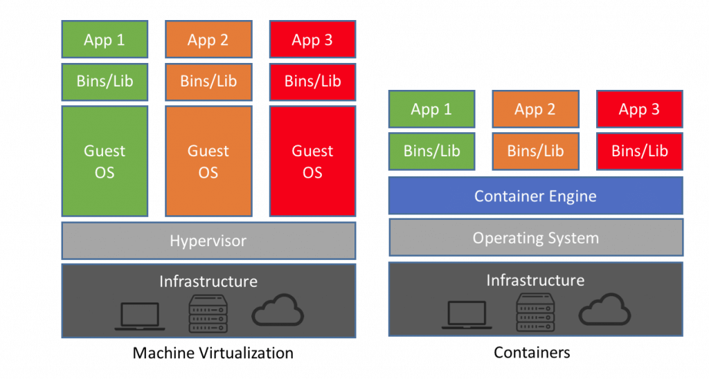
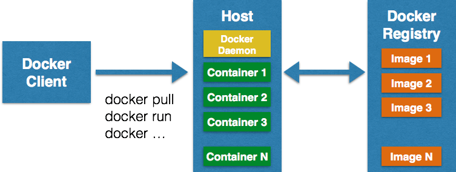
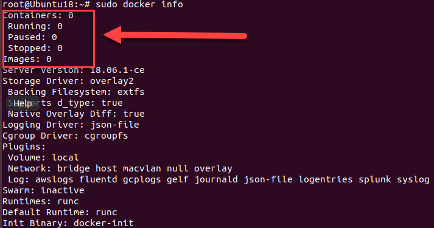

# Docker Tutorial for Beginners: What is, Architecture, Install, Commands

## History of Virtualization
Earlier, the process for deploying a service was slow and painful. First, the developers were writing code; then the operations team would deploy it on bare metal machines, where they had to look out for library versions, patches, and language compilers for the code to work. If there were some bugs or errors, the process would start all over again, the developers would fix it, and then again the operational team was there to deploy.

There was an improvement with the creation of Hypervisors. Hypervisors have multiple Virtual machines or VMs on the same host, which may be running or turned off. VMs decreased the waiting time for deploying code and bug fixing in a big manner, but the real game changer was Docker containers.

In this tutorial, you will learn

* History of Virtualization
* What is Docker?
* Docker Architecture:
* Docker Engine
* Docker Images
* Registries
* Docker Containers
* Installing Docker on Linux.
* Basic Docker commands

## What is Docker?
Docker is computer software used for Virtualization in order to have multiple Operating systems running on the same host. Unlike Hypervisors which are used for creating VM (Virtual machines), virtualization in Docker is performed on system-level in so-called Docker containers.

As you can see the difference in the image below, Docker containers run on top of the host's Operation system. This helps you to improves efficiency. Moreover, we can run more containers on the same infrastructure than we can run Virtual machines because containers use fewer resources.




Unlike the VMs which can communicate with the hardware of the host (ex: Ethernet adapter to create more virtual adapters) Docker containers run in an isolated environment on top of the host's OS. Even if your host runs Windows OS, you can have Linux images running in containers with the help of Hyper-V, which automatically creates small VM to virtualize the system's base image, in this case, Linux.

## Docker Architecture
Let's talk about Docker main components in the Docker Architecture

### Docker Engine
Docker is the client-server type of application which means we have clients who relay to the server. So the Docker daemon called: dockerd is the Docker engine which represents the server. The docker daemon and the clients can be run on the same or remote host, and they communicate through command line client binary, as well as a full RESTful API to interact with the daemon: dockerd.

### Docker Images
Docker images are the "source code" for our containers; we use them to build containers. They can have software pre-installed which speeds up deployment. They are portable, and we can use existing images or build our own.

### Registries
Docker stores the images we build in registries. There are public and private registries. Docker company has public registry called Docker hub, where you can also store images privately. Docker hub has millions of images, which you can start using now.

### Docker Containers
Containers are the organizational units of Docker. When we build an image and start running it; we are running in a container. The container analogy is used because of the portability of the software we have running in our container. We can move it, in other words, "ship" the software, modify, manage, create or get rid of it, destroy it, just as cargo ships can do with real containers.

In simple terms, an image is a template, and a container is a copy of that template. You can have multiple containers (copies) of the same image.

Below we have an image which perfectly represents the interaction between the different components and how Docker container technology works.



## Installing Docker on Linux.
To install docker, we need to use the Docker team's DEB packages. For that, first, we need to install some prerequisite packages.

* Adding prerequisite Ubuntu packages
  
  ```console
  $ sudo apt-get install \
    apt-transport-https \
    ca-certificates curl \
    software-properties-common
  ```
* Add the Docker GPG key
 
 ```console
 $ curl -fsSL https://download.docker.com/linux/ubuntu/gpg | sudo apt-key add -
 ```
* Adding the Docker APT repository

 ```console
$ sudo add-apt-repository \ 
"deb [arch=amd64] https://download.docker.com/linux/ubuntu \ 
$(lsb_release -cs) \
stable"
 ```

You may be prompted to confirm that you wish to add the repository and have the repository's GPG key automatically added to your host.

The lsb_release command should populate the Ubuntu distribution version of your host.

* Update APT sources

```console
$ sudo apt-get update
```
We can now install the Docker package itself.

* Installing the Docker packages on Ubuntu

```console
$ sudo apt-get install docker-ce
```
The above-given command installs Docker and other additional required packages. Before Docker 1.8.0, the package name was lxc-docker, and between Docker 1.8 and 1.13, the package name was docker-engine.

NOTE: Docker for Windows requires Windows 10 Pro or Enterprise version 14393, or Windows server 2016 RTM to run.

## Basic Docker commands
The most basic command we must run after installing Docker is $ docker info as we said previously.
```console
$ sudo docker info
```
You should get the similar or following result



As we can see we have information about docker containers how many are running, paused or stopped and how many images we have downloaded. So let's get our first image.

```console
$ sudo docker pull alpine
```
With this command we are telling docker to download the image alpine, to pull it from the public registry, the latest version which is set by default.

*alpine is a minimal Docker image based on Alpine Linux with a complete package index and only 5 MB in size.

If we want to run the image as a container, we will use the following command.

```console
$ sudo docker run -i -t alpine /bin/bash
```
If we run the command, we will be sent directly to the alpine's terminal. The -i flag keeps STDIN open from the container, even when you are not attached to it. This persistent standard input is one half of what you require for an interactive shell. The -t flag is the other half and which instructs Docker to assign a pseudo-tty to the container. This offers us an interactive shell in the new container. We exit the container with a simple exit command.

Now we can try running an Ubuntu image.

```console
$ sudo docker run -it ubuntu /bin/bash
```

You can notice docker checks for the image locally, and if it's not there, the image is pulled from the image library automatically, and once again we have an interactive shell running. We can also name the containers as we run them.

```console
$ sudo docker run –-name our_container -it ubuntu /bin/bash
```

and we exit again.

We can also run container we previously created, without an interactive shell.

```console
$ sudo docker start container_name
```

And stop the container writing docker stop container_name

```console
$ sudo docker stop container_name
```

After stoping the container remove the container

```console
$ sudo docker rm container_name
```

If we want to see all running containers, we just run

```console
$ docker ps
```
